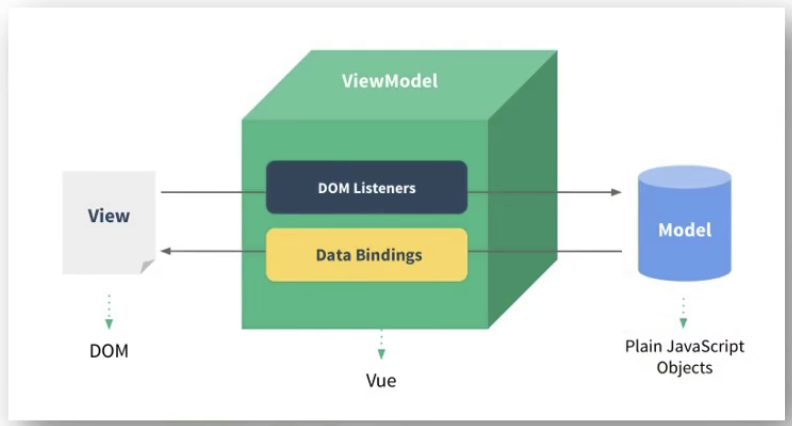
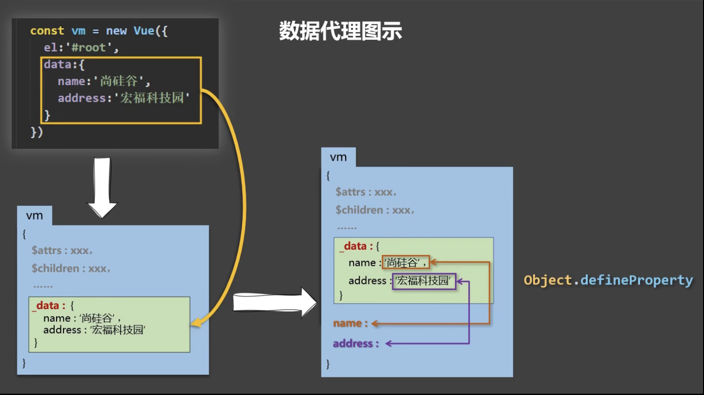

# 尚硅谷Vue2.0+Vue3.0全套教程

## 第一课：001课程简介

这套课程将会介绍

- Vue基础
- Vue-cli
- Vue-router
- Vuex
- Element-ui
- Vue3

## 第二课：002Vue简介

### 1. Vue是什么？

- 一套用于构建用户界面的渐近式JavaScript框架
  - 构建用户界面：把数据在一个页面上显示出来
  - 渐近式：vue可以自底向上逐层应用
    - 简单应用：只需一个轻量小巧的核心库
    - 复杂应用：可以引入各式各样的Vue插架

### 2. 谁开发的？

尤雨溪

### 3. Vue的特点

1. 采用组件化模式，提高代码复用率、且让代码更好维护
2. 声明式编码，让编码人员无需直接操作DOM，提高开发效率
3. 使用虚拟DOM+优秀的Diff算法，尽量复用DOM节点

### 4.  学习Vue之前要掌握的JavaScript基础知识

- ES6语法规范
- ES6模块化
- 包管理器
- 原型，原型链
- 数组常用方法
- axios
- promise

## 第三课：003Vue官网使用指南

在***学习***板块：主要看***教程***和***API***

## 第四课：004搭建Vue开发环境

***对应文件夹名：01_初识vue***

### 直接用``

`Vue.config.productionTip = false // 阻止vue在启动时生成生产提示 `

 

## 第五课：005hello小案例

***对应文件夹名：01_初识vue***

### 总结

1. 想让vue工作，就必须创建一个Vue实例，且要传入一个配置对象

2. root容器里的代码依然符合html规范，只不过混入了一些特殊的Vue语法

3. root容器里的代码被称为`vue模版`

## 第六课：006分析hello案例

***对应文件夹名：01_初识vue***

### 总结

4. Vue实例和容器是一一对应的
5. 真实开发中只有一个Vue实例，并且会配合着组件一起使用
6. `{{xxx}}` 中的xxx要写js表达式，且xxx可以自动读取到data中的所有属性
7. 一旦data中的数据发生改变，那么页面中用到该数据的地方也会自动更新

注意区分：js表达式和js代码（语句）

1. 表达式：一个表达式会 产生一个值，可以放在任何一个需要值的地方：
   1. a
   2. a+b
   3. demo(1)
   4. `x === y ? 'a' : 'b'`
2. js代码（语句）
   1.  `if(){}`
   2. `for(){}`

## 第七课：007模板语法

***对应文件夹名：02_Vue模版语法***

### 总结

Vue模版语法有两大类：

1. 插值语法
   - 功能：用于解析标签体内容
   - 写法：`{{xxx}}`，xxx是表达式，且可以直接读取到data中的所有属性。
2. 指令语法：
   - 功能：用于解析标签（包括：标签属性、标签体内容、绑定事件......）
   - 举例：`v-bind:href="xxx"`或 简写为 `:href="xxx"`， xxx同样要写js表达式，且可以直接读取到data中的所有属性
   - 备注：Vue中有很多的指令，且形式都是：v-????，此处我们只是拿v-bind举例

## 第八课：008数据绑定

***对应文件夹名：03_数据绑定***

### 总结

Vue中有两种数据绑定的方式：

1. 单项绑定（v-bind）：数据只能从data流向页面
2. 双向绑定（v-model）：数据不仅能从data流向页面，还可以从页面流向data
   - 备注：
     1. 双向绑定一般都应用在表单类元素上（如：input、select等）
     2. v-model:value 可以简写为v-model，因为v-model默认收集的就是value值

## 第九课：009el与data的两种写法

***对应文件夹名：04_el与data的两种写法***

### 总结

data与el的两种写法

1. el有两种写法

   1. new Vue时候配置el属性
   2. 先创建Vue实例，随后再通过`vm.$mount('#root')`指定el的值

2. data有两种写法

   1. 对象式
   2. 函数式

   如何选择：目前哪种写法都可以，以后学习到组件时，data必须使用函数式，否则会报错。

3. 一个重要的原则：

   由Vue管理的函数，一定不要写箭头函数，一旦写了剪头函数，this就不再是Vue的实例了

## 第十课：010理解MVVM

***对应文件夹名：05_MVVM模型***

1. M：模型（Model）：对应data中的数据
2. V：视图（View）：模板
3. VM：视图模型（ViewModel）：Vue实例对象

### 总结

MVVM模型

1. M：模型（Model）：对应data中的数据
2. V：视图（View）：模板
3. VM：视图模型（ViewModel）：Vue实例对象

观察发现：

1. data中所有的属性，最后都出现在了vm身上
2. vm身上所有的属性及Vue原型上的所有属性，在Vue模版中都可以直接使用

## 第十一课：011Object.defineProperty

***对应文件名：06_数据代理/1.回顾Object.defineProperty方法.html***

## 第十二课：012理解数据代理

***对应文件名：06_数据代理/2.何为数据代理.html***

 

## 第十三课：013Vue中的数据代理

***对应文件名：06_数据代理/3.Vue中的数据代理.html***

### 总结

1. Vue中的数据代理：通过vm对象来代理data对象中属性的操作（读/写）
2. Vue中数据代理的好处：更加方便的操作data中的数据
3. 基本原理：通过`Object.defineProperty()`把data对象中所有属性添加到vm上。为每一个添加到vm上的属性，都指定一个getter/setter。在getter/setter内部去操作（读/写）data中的对应的属性

## 第十四课：014事件处理

