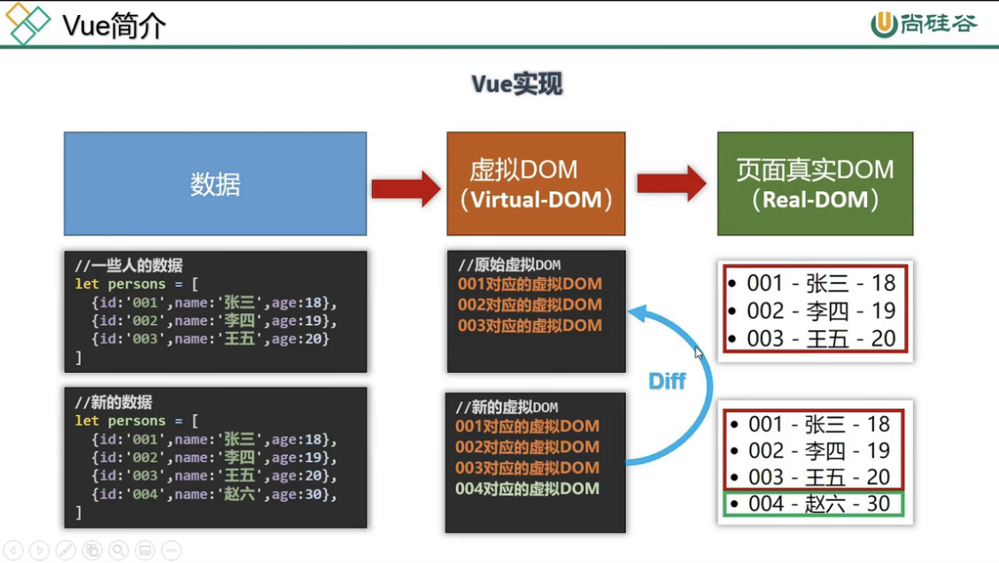
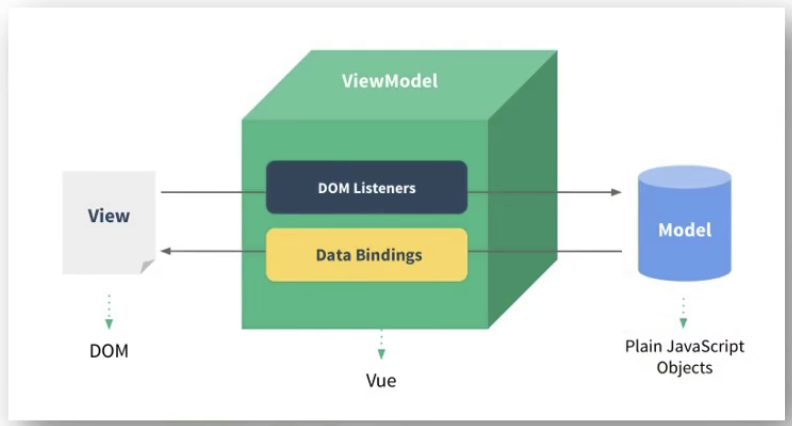
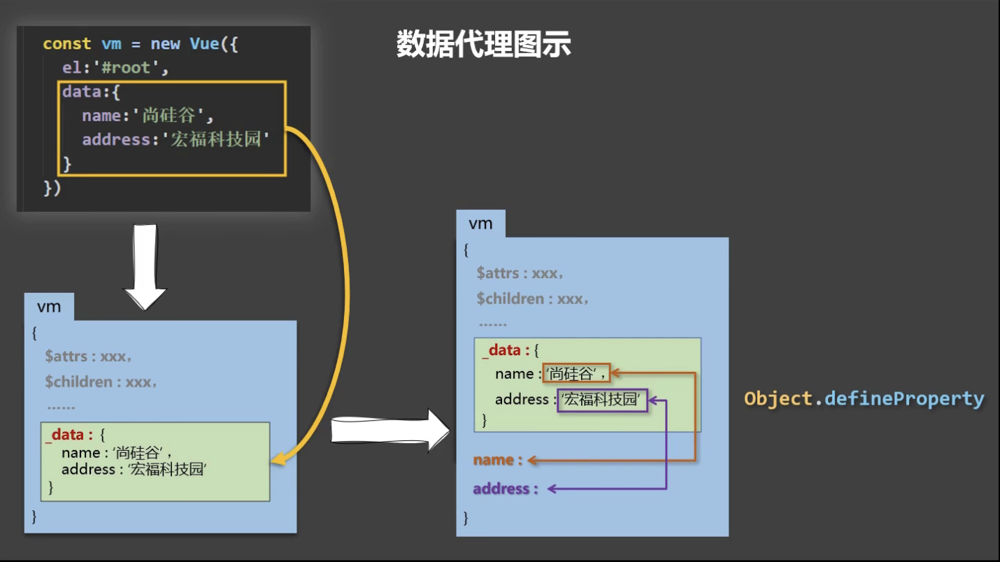

# 尚硅谷Vue2.0+Vue3.0全套教程

## 第一课：001课程简介

这套课程将会介绍

- Vue基础
- Vue-cli
- Vue-router
- Vuex
- Element-ui
- Vue3

## 第二课：002Vue简介

### 1. Vue是什么？

- 一套用于构建用户界面的渐近式JavaScript框架
  - 构建用户界面：把数据在一个页面上显示出来
  - 渐近式：vue可以自底向上逐层应用
    - 简单应用：只需一个轻量小巧的核心库
    - 复杂应用：可以引入各式各样的Vue插架

### 2. 谁开发的？

尤雨溪

### 3. Vue的特点

1. 采用组件化模式，提高代码复用率、且让代码更好维护
2. 声明式编码，让编码人员无需直接操作DOM，提高开发效率
3. 使用虚拟DOM+优秀的Diff算法，尽量复用DOM节点

### 4.  学习Vue之前要掌握的JavaScript基础知识

- ES6语法规范
- ES6模块化
- 包管理器
- 原型，原型链
- 数组常用方法
- axios
- promise

## 第三课：003Vue官网使用指南

在***学习***板块：主要看***教程***和***API***

## 第四课：004搭建Vue开发环境

***对应文件夹名：01_初识vue***

### 直接用``

`Vue.config.productionTip = false // 阻止vue在启动时生成生产提示 `

 

## 第五课：005hello小案例

***对应文件夹名：01_初识vue***

### 总结

1. 想让vue工作，就必须创建一个Vue实例，且要传入一个配置对象

2. root容器里的代码依然符合html规范，只不过混入了一些特殊的Vue语法

3. root容器里的代码被称为`vue模版`

## 第六课：006分析hello案例

***对应文件夹名：01_初识vue***

### 总结

4. Vue实例和容器是一一对应的
5. 真实开发中只有一个Vue实例，并且会配合着组件一起使用
6. `{{xxx}}` 中的xxx要写js表达式，且xxx可以自动读取到data中的所有属性
7. 一旦data中的数据发生改变，那么页面中用到该数据的地方也会自动更新

注意区分：js表达式和js代码（语句）

1. 表达式：一个表达式会 产生一个值，可以放在任何一个需要值的地方：
   1. a
   2. a+b
   3. demo(1)
   4. `x === y ? 'a' : 'b'`
2. js代码（语句）
   1.  `if(){}`
   2. `for(){}`

## 第七课：007模板语法

***对应文件夹名：02_Vue模版语法***

### 总结

Vue模版语法有两大类：

1. 插值语法
   - 功能：用于解析标签体内容
   - 写法：`{{xxx}}`，xxx是表达式，且可以直接读取到data中的所有属性。
2. 指令语法：
   - 功能：用于解析标签（包括：标签属性、标签体内容、绑定事件......）
   - 举例：`v-bind:href="xxx"`或 简写为 `:href="xxx"`， xxx同样要写js表达式，且可以直接读取到data中的所有属性
   - 备注：Vue中有很多的指令，且形式都是：v-????，此处我们只是拿v-bind举例

## 第八课：008数据绑定

***对应文件夹名：03_数据绑定***

### 总结

Vue中有两种数据绑定的方式：

1. 单项绑定（v-bind）：数据只能从data流向页面
2. 双向绑定（v-model）：数据不仅能从data流向页面，还可以从页面流向data
   - 备注：
     1. 双向绑定一般都应用在表单类元素上（如：input、select等）
     2. v-model:value 可以简写为v-model，因为v-model默认收集的就是value值

## 第九课：009el与data的两种写法

***对应文件夹名：04_el与data的两种写法***

### 总结

data与el的两种写法

1. el有两种写法

   1. new Vue时候配置el属性
   2. 先创建Vue实例，随后再通过`vm.$mount('#root')`指定el的值

2. data有两种写法

   1. 对象式
   2. 函数式

   如何选择：目前哪种写法都可以，以后学习到组件时，data必须使用函数式，否则会报错。

3. 一个重要的原则：

   由Vue管理的函数，一定不要写箭头函数，一旦写了剪头函数，this就不再是Vue的实例了

## 第十课：010理解MVVM

***对应文件夹名：05_MVVM模型***

1. M：模型（Model）：对应data中的数据
2. V：视图（View）：模板
3. VM：视图模型（ViewModel）：Vue实例对象

### 总结

MVVM模型

1. M：模型（Model）：对应data中的数据
2. V：视图（View）：模板
3. VM：视图模型（ViewModel）：Vue实例对象

观察发现：

1. data中所有的属性，最后都出现在了vm身上
2. vm身上所有的属性及Vue原型上的所有属性，在Vue模版中都可以直接使用

## 第十一课：011Object.defineProperty

***对应文件名：06_数据代理/1.回顾Object.defineProperty方法.html***

## 第十二课：012理解数据代理

***对应文件名：06_数据代理/2.何为数据代理.html***

 

## 第十三课：013Vue中的数据代理

***对应文件名：06_数据代理/3.Vue中的数据代理.html***

### 总结

1. Vue中的数据代理：通过vm对象来代理data对象中属性的操作（读/写）
2. Vue中数据代理的好处：更加方便的操作data中的数据
3. 基本原理：通过`Object.defineProperty()`把data对象中所有属性添加到vm上。为每一个添加到vm上的属性，都指定一个getter/setter。在getter/setter内部去操作（读/写）data中的对应的属性

## 第十四课：014事件处理

***对应文件名：07_事件处理/1.事件的基本使用.html***

 

### 总结

事件的基本使用：

1. 使用`v-on:xxx`或`@xxx`绑定事件，其中`xxx`是事件名；
2. 事件的回调需要配置在methods对象中，最终会在vm上；
3. methods中配置的函数，不要用箭头函数！否则this就就不是vm了；
4. methods中的配置函数，都是被Vue所管理的函数，this的指向是vm 或 组件实例对象；
5. `@click="demo"`和 `@click="demo($event)"`效果一致，但后者可以传参；

## 第十五课：015事件修饰符

***对应文件名：07_事件处理/2.事件修饰符.html***

### 总结

Vue中的事件修饰符：

1. prevent：阻止默认事件（常用）；
2. stop：阻止事件冒泡（常用）；
3. once：事件只触发一次（常用）；
4. capture：使用事件的捕获模式；
5. self：只有event.target是当前操作的元素时才触发事件；
6. passive：事件的默认行为立即执行，无需等待事件回调执行完毕；

## 第十六课：016键盘事件

***对应文件名：07_事件处理/3.键盘事件.html***

### 总结

1. Vue中常用的按键别名：
   - `回车 => enter`
   - `删除 => delete(捕获“删除”和“退格”键)`
   - `退出 => esc`
   - `空格 => space`
   - `换行 => tab`
   - `上 => up`
   - `下 => down`
   - `左 => left`
   - `右 => right`

2. Vue未提供别名的按键，可以使用按键原始的key值去绑定，但注意要转为kebab-case（短横线命名）
3. 系统修饰键（用法特殊）：`ctrl`、 `alt`、 `shift`、 `meta`
   1. 配合keyup使用：按下修饰键的同时，再按下其他键，随后释放其他键，事件才被触发
   2. 配合keydown使用：正常触发事件
4. 也可以使用keyCode去指定具体的按键（不推荐）
5. Vue.config.keyCodes.自定义键名 =  键码，可以去定制按键别名

## 第十七课：017事件总结

***对应文件名：07_事件处理***

## 第十八课：018姓名案例

***对应文件名：08_计算属性/1.姓名案例_插值语法实现.html*** 和 ***08_计算属性/2.姓名案例_methods实现.html***

## 第十九课：019计算属性

***对应文件名：08_计算属性/3.姓名实例_计算属性实现.html***

### 总结

计算属性：

1. 定义：要用的属性不存在，要通过已有属性计算得来
2. 原理：底层借助了Object.defineProperty方法提供的getter和setter
3. get函数什么时候执行？
   1. 初次读取时会执行一次
   2. 当依赖的数据发生改变时会被再次调用
4. 优势：与methods实现相比，内部有缓存机制（复用），效率更高，调试方便
5. 备注：
   1. 计算属性最终会出现在vm上，直接读取使用即可。
   2. 如果计算属性要被修改，那必须写set函数去响应修改，且set中要引起计算时的依赖的数据发生改变 

## 第二十课：020计算属性简写

***对应文件名：08_计算属性/4.姓名实例_计算属性简写.html***

### 

## 第二十一课：021天气案例

***对应文件名：09_监视属性/1.天气案例.html***

## 第二十二课：022监视属性

***对应文件名：09_监视属性/2.天气案例_监视属性.html***

### 总结

​	监视属性watch：

1. 当被监视的属性变化时，回调函数自动调用，进行相关操作
2. 监视的属性必须存在，才能进行监视！！
3. 监视的两种办法：
   1. new Vue时传入watch配置
   2. 通过vm.$watch监视

## 第二十三课：023深度监视

***对应文件名：09_监视属性/3.天气案例_深度监视.html***

### 总结

深度监视：

1. Vue中的watch默认不监测对象内部值的改变（一层）。
2. 配置deep:true可以监测对象内部值改变（多层）。

备注：

1. Vue自身可以监测对象内部值的改变，但Vue提供的watch默认不可以！
2. 使用watch时根据数据的具体结构，决定是否采用深度监视

 

## 第二十四课：024监视的简写形式

***对应文件名：09_监视属性/4.天气案例_监视属性_简写.html***

## 第二十五课：025watch对比computed

***对应文件名：09_监视属性/5.姓名案例_watch实现.html***

### 总结

compute和watch之间的区别：

1. computed能完成的功能，watch都可以完成。
2. watch能完成的功能，computed不一定能完成，例如：watch可以进行异步操作

两个重要的小原则：

1. 所被Vue管理的函数，最好写成普通函数，这样this的指向才是 vm 或 组件实例对象。
2. 所有不被Vue管理的函数（定时器的回调函数、ajax的回调函数等、Promise的回调函数），最好写成箭头函数，这样this的指向才是vm 或 组件实例对象。

## 第二十六课：026绑定class样式

***对应文件名：10_绑定样式/绑定样式.html***

## 第二十七课：027绑定style样式

***对应文件名：10_绑定样式/绑定样式.html***

### 总结

绑定样式：

1. class样式

   写法：class=“xxx” xxx可以是字符串，对象，数组

   ​	字符串写法适用于：类名不确定，要动态获取

   ​	对象写法适用于：要绑定多个样式，个数不确定，名字也不确定

   ​	数组写法适用于：要绑定多个样式，个数确定，名字也确定，但不确定用不用

2. style样式

​		`:style="{fontSize: xxx}"`其中xxx是动态值

​		`:style="[a,b]"`其中a、b是样式对象

## 第二十八课：028条件渲染

***对应文件名：11_条件渲染/条件渲染.html***

### 总结

条件渲染：

1. v-if

   写法：

   1. v-if=“表达式”
   2. v-else-if=“表达式”
   3. v-else=“表达式”

   适用于：切换频率较低的场景

   特点：不展示的DOM元素直接被移除

   注意：v-if可以和v-else-if、v-else一起使用，但要求结构不能被“打断”

2. v-show

​		写法：v-show=“表达式”

​		适用于：切换频率较高的场景

​		特点：不展示的DOM元素未被移除，仅仅是使用样式隐藏掉

3. 使用v-if时，元素可能无法获取到，而使用v-show一定可以获取到

## 第二十九课：029列表渲染

***对应文件名：12_列表渲染/1.基本列表.html***

### 总结

v-for指令

1. 用于展示列表数据
2. 语法：`v-for="(item, index) in xxx" :key="yyy"`
3. 可遍历：数组、对象、字符串（用得很少）、指定次数（用得很少）

## 第三十课：030key作用与原理

***对应文件名：12_列表渲染/2.key的原理.html***

### 总结

面试题： react、vue中的key有什么作用？（key的内部原理）

1. 虚拟DOM中key的作用：

   key是虚拟DOM对象的标识，当数据发生变化时，Vue会根据【新数据】生成【新的虚拟DOM】，随后Vue进行【新虚拟DOM】与【旧虚拟DOM】的差异比较，比较规则如下：

2. 对比规则：

   1. 旧虚拟DOM中找到了新虚拟DOM相同的key：
      1. 若虚拟DOM中内容没变，直接使用之前的真实DOM！
      2. 若虚拟DOM中内容变了，则生成新的真实DOM，随后替换掉页面中之前的真实DOM
   2. 旧虚拟DOM中未找到与新虚拟DOM相同的key
      1. 创建新的真实DOM，随后渲染到页面

3. 用index作为key可能会引发的问题：

   1. 若对数据进行：逆序添加，逆序删除等破环顺序操作：

      会产生没有必要的真实DOM更新 ==> 界面效果没有问题，但效率低。

   2. 如果结构中还包含输入类的DOM：

      会产生错误DOM更像 ==> 界面有问题。

4. 开发中如何选择key？：

   1. 最好使用每条数据的唯一标识作为key，比如id、手机号、身份证号、学号等唯一值。
   2. 如果不存在对数据的逆序添加、逆序删除等破环顺序操作，仅用于渲染列表用于展示，使用index作为key是没有问题的。

## 第三十一课：031列表过滤

***对应文件名：12_列表渲染/3.列表过滤.html***

## 第三十二课：032列表排序

***对应文件名：12_列表渲染/4.列表排序.html***

## 第三十三课：033更新时的一个问题

***对应文件名：12_列表渲染/5.更新时的一个问题.html***

## 第三十四课：034Vue监测数据的原理_对象

***对应文件名：12_列表渲染/6.Vue监测数据改变的原理_对象.html*** 和 ***12_列表渲染/7.模拟一个数据监测.html***

## 第三十五课：035Vue.set()方法

***对应文件名：12_列表渲染/8.Vue.set的使用.html***

 

## 第三十六课：036Vue监测数据的原理_数组

***对应文件名：12_列表渲染/9.Vue监测数据改变的原理_数组.html***

## 第三十七课：037总结Vue数据监测

***对应文件名：12_列表渲染/10.总结Vue数据监测.html***

### 总结

Vue监视数据的原理：

1. vue会监视data中所有层次的数据

2. 如何监测对象中的数据？

   通过setter实现监视，且要在new Vue时就传入要监测的数据。

   1. 对象中后追加的属性，Vue默认不做响应式处理
   2. 如需给后添加的属性做响应式，请使用如下API：
      - `Vue.set(target, propertyName/index, value)`
      - `vm.$set(target, propertyName/index, value)`

3. 如何监测数组中的数据？

   通过包裹数组更新元素的方法实现，本质就是做了两件事：

   1. 调用原生对应的方法对数组进行更新。
   2. 重新解析模块，进而更新页面。

4. 在Vue修改数组中的某个元素一定要用如下方法：

   1. 使用这些API：`push(),pop(),shift(),unshift(),splice(),sort(),reverse()`
   2. Vue.set() 或 vm.$set()

特别注意：Vue.set() 和 vm.$set() 不能给vm或vm的根数据对象 添加属性！！！

## 第三十八课：038收集表单数据

***对应文件名：13_收集表单数据/收集表单数据.html***

### 总结

收集表达数据：

- 若：`<input type="text" />`，则v-model收集的值是value值，用户输入的就是value值。

- 若：`<input type="radio" />`，则v-model收集的值时value值，且要给标签配置value值。
- 若：`<input type="checkbox" />`，
  1. 没有配置input的value属性，那么收集的就是checked（勾选 or 未勾选，是布尔值）
  2. 配置input的value属性：
     1. v-model的初始值是非数组，那么收集的就是checked（勾选 or 未勾选，是布尔值）
     2. v-model的初始值是数组，那么收集的就是value组成的数组
- 备注：v-model的三个修饰符
  - lazy：失去焦点再收集数据
  - number：输入字符串转为有效的数字
  - trim：输入首尾空格过滤

### 第三十九课：039过滤器

***对应文件名：14_过滤器/过滤器.html***

### 总结

过滤器：

- 定义：对要显示的数据进行特定格式化后再显示（适用于一些简单逻辑的处理）。

- 语法：

  1. 注册过滤器：`Vue.filter(name, callback)`或`new Vue({filters:{}})`
  2. 使用过滤器：`{{ xxx | 过滤器名}}` 或 `v-bind:属性 = "xxx | 过滤器名"`

- 备注：

  1. 过滤器也可以接受额外参数，多个过滤器也可以串联
  2. 并没有改变原本的数据，是产生新的对应的数据

  
